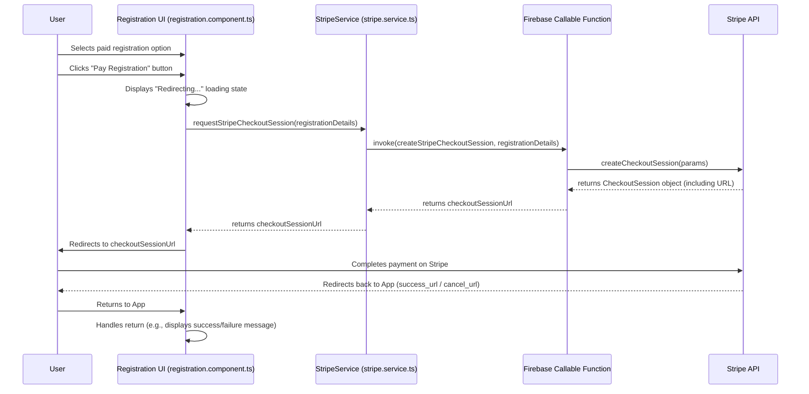

# Architecture for UI Paid Registration via Stripe Checkout (Issue #1079)

## Objective
Integrate client-side UI to initiate paid registration via Stripe Checkout, leveraging existing Firebase Functions, while maintaining application reliability and security in a static-site/Firebase environment.

## Current State (Implicit)
*   Static-site application (Angular/HTML/JS) hosted on Firebase Hosting.
*   Backend services (Authentication, Firestore, Firebase Functions) handle core application logic.
*   Stripe payment processing is managed server-side via Firebase Functions (e.g., `createStripeCheckoutSession`).

## Proposed State
Enhance the client-side registration UI to allow users to select paid options and trigger the Stripe Checkout flow by invoking an existing Firebase Callable Function.

## Key Architectural Components & Interactions

### 1. Client-Side Application (Angular/HTML/JS)
*   **`src/app/registration/registration.component.ts`:**
    *   Manages the registration step-by-step flow, including displaying registration options (paid vs. free).
    *   Presents the "Pay Registration" button to initiate the payment process.
    *   Handles UI state during payment initiation (e.g., loading spinners).
    *   Receives the Stripe Checkout URL from `StripeService`.
    *   Performs the redirection to Stripe Checkout (`window.location.href`).
    *   Manages the return from Stripe, potentially by listening for URL parameters or leveraging router guards.
*   **`src/app/shared/services/stripe.service.ts`:**
    *   A new or updated service dedicated to client-side interactions with Stripe (specifically, invoking the Firebase Function to create a checkout session).
    *   Encapsulates the Firebase Callable Function invocation logic.
    *   Returns the Stripe Checkout Session URL to the calling component.
*   **HTML Templates:** Render payment options, the payment button, and display relevant messages/indicators.

### 2. Firebase Callable Function (Existing Backend - Out of Scope for Modification)
*   An existing Firebase Function (e.g., `createStripeCheckoutSession`) is responsible for:
    *   Receiving registration details and payment intent from the client.
    *   Interacting securely with the Stripe API to create a Checkout Session.
    *   Returning the generated Stripe Checkout Session URL (and potentially the session ID) back to the client.
    *   This function must be robust and handle all server-side Stripe logic, including setting `success_url` and `cancel_url` for redirection back to the client application.

### 3. Stripe Checkout (External Service - Out of Scope for Modification)
*   The secure, hosted payment page provided by Stripe.
*   Handles all PCI compliance requirements.

## Data Flow / Sequence Diagram (Conceptual)

## Reliability Considerations
*   **Frontend Error Handling:** The UI must gracefully handle failures in invoking the Firebase Function (e.g., network issues, function errors) by displaying informative messages and offering retry options.
*   **Loading States:** Clear loading indicators are essential during the `FCF` invocation and before redirection to Stripe to prevent user confusion.
*   **Redirection Integrity:** Ensure `success_url` and `cancel_url` configured in the Firebase Function correctly point back to the appropriate application routes.

## Security Considerations
*   **Sensitive Data Handling:** Client-side remains free of sensitive payment information. All payment data is securely handled by Stripe and the Firebase Function.
*   **Authentication & Authorization:** The Firebase Callable Function should enforce that only authenticated and authorized users can request a Stripe Checkout Session.

## Blast Radius
*   The proposed changes are contained within the client-side `registration` feature and the `shared/services` layer.
*   No modifications to the existing Firebase Callable Function or core Stripe integration are required by this slice, limiting impact on critical backend systems.
*   Dependencies are primarily on the existing Firebase SDK (`firebase/app`, `firebase/functions`) for callable function invocation and standard browser `window.location` for redirection.
