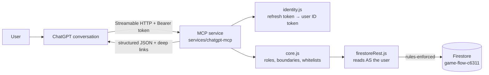

# ChatGPT App Integration — Design

## Overview

A thin Node.js MCP service (`services/chatgpt-mcp/`) exposes permission-aware read tools over Streamable HTTP. It resolves the caller's identity from the bearer token and performs **user-credentialed Firestore access over the REST API** — every read carries the user's own Firebase ID token, so the same `firestore.rules` that protect the web/app clients authorize each read. The service holds no privileged credentials (no service account, no Admin SDK). Domain logic lives in a pure, dependency-injected core module.

Tool names mirror the in-app private AI registry (`apps/app/src/lib/privateAiService.ts`, ~45 tools with confirmation-staged writes and audit) so the ChatGPT surface and the app assistant converge on one catalog; extracting that registry's summarizers into shared code is the follow-on reuse task.

Per the plan (§4): "Build the app as a thin orchestration layer over a reusable AllPlays application service. Do not embed business rules or authorization only inside MCP tool handlers."

## Architecture

- **Transport:** `@modelcontextprotocol/sdk` `StreamableHTTPServerTransport` in stateless mode (new server+transport per request) — Cloud Run friendly, no session affinity needed.
- **Hosting target:** Cloud Run (plan §4). The spike runs locally (`npm start`) and connects to Developer Mode via a tunnel or a dev Cloud Run revision.

## Components

| File | Responsibility |
|---|---|
| `src/server.js` | Express app, auth middleware, MCP tool registration, transport wiring |
| `src/identity.js` | Bearer token → `{uid, email, idToken}`: Firebase refresh-token exchange via `securetoken.googleapis.com` (public web API key), cached until expiry; raw ID tokens also accepted |
| `src/firestoreRest.js` | Firestore REST adapter scoped to the user's ID token — rules-enforced reads; maps 403 → `permission_denied`, 404 → not-found |
| `src/core.js` | Pure domain logic with injected Firestore handle: role resolution, schedule assembly, game summary, field whitelists, deep links |
| `src/oauth.js` | OAuth 2.1 broker: dynamic client registration, authorization code + PKCE (S256), refresh grant; opaque broker tokens map to the user's Firebase refresh token. In-memory storage (single-instance dev); Firestore-backed storage before multi-instance Cloud Run |
| `scripts/get-token.mjs` | Sign-in helper that prints the refresh token (manual curl testing) |

## Identity and authorization

1. Every request must carry `Authorization: Bearer <token>` — a Firebase **refresh token** (long-lived, suits a static connector secret) or a raw ID token.
2. The refresh token is exchanged for a short-lived ID token and cached. That ID token is presented to Firestore on **every read**, so `firestore.rules` — identical to the parent UI's enforcement — is the authorization boundary. A forged JWT yields identity claims but fails every Firestore call. The production OAuth broker (plan §6) replaces the raw refresh token with a proper authorization-code + PKCE flow yielding the same user-scoped credential.
3. As defense-in-depth, `resolveUserContext(db, {uid, email})` also rebuilds the role context per request:
   - owner: `teams` where `ownerId == uid`
   - admin: `teams` where `adminEmails array-contains lowercased email`
   - parent: `users/{uid}.parentOf[] → {teamId, playerId}` (team docs fetched to confirm existence)
   - `isGlobalAdmin`: `users/{uid}.isAdmin === true`
4. Tool arguments naming teams/players are validated against this context; anything outside it → `permission_denied` with no data.

## Data model touchpoints (existing collections, read-only)

- `users/{uid}` — `parentOf`, `parentTeamIds`, `email`, `isAdmin`
- `teams/{teamId}` — `name`, `ownerId`, `adminEmails`
- `teams/{teamId}/players/{playerId}` — `name`, `number` only (never `private/profile`)
- `teams/{teamId}/games/{gameId}` — `type` (`game`/`practice`), `date` (Timestamp), `opponent`, `location`, `homeScore`/`awayScore`, `rsvpSummary`
- `teams/{teamId}/games/{gameId}/rsvps/{uid}` — the caller's own RSVP doc
- `teams/{teamId}/games/{gameId}/aggregatedStats/{playerId}` — per-player stats (public tier; `privatePlayerStats` is never read)

## Tool contract (MVP)

| Tool | Mode | Input | Output |
|---|---|---|---|
| `get_profile` | Read | — | `{teams: [{teamId, name, roles[], linkedPlayers[{playerId, name, number}]}]}` |
| `list_schedule` | Read | `startDate?`, `endDate?` (ISO; default today → +7d) | `{events: [{teamId, teamName, gameId, type, date, opponent, location, rsvpSummary, myRsvp?, deepLink}]}` |
| `get_game_summary` | Read | `teamId`, `gameId` | `{game: {…whitelisted}, playerStats[], deepLink}` |

Deep links use the validated legacy routes, e.g. `https://allplays.ai/live-game.html?teamId=…&gameId=…&replay=true`.

## Embedded UI (Phase 2 — research, July 2026)

How Apps SDK components work (sources: developers.openai.com/apps-sdk — build/custom-ux and reference pages; `openai/openai-apps-sdk-examples` repo, e.g. `pizzaz_server_node`):

- A component is an HTML+JS bundle the MCP server serves as a **resource** (`ui://widget/<name>.html`, mimeType `text/html;profile=mcp-app`), rendered by ChatGPT in a sandboxed iframe inline in the conversation.
- A tool opts into UI via `_meta["openai/outputTemplate"]` (alias `_meta.ui.resourceUri`) pointing at that resource, plus optional `openai/toolInvocation/invoking|invoked` status strings.
- Data flow: the tool result's `structuredContent` feeds both the model and the widget (`window.openai.toolOutput`); result `_meta` flows **only** to the widget (never the model/transcript). Our `toolResult()` already returns `structuredContent`, so existing tools are UI-ready without contract changes.
- Widget runtime (`window.openai`): `toolInput`, `toolOutput`, `widgetState`/`setWidgetState`, `callTool` (requires `_meta["openai/widgetAccessible"]: true` on the target tool), `sendFollowUpMessage`, `openExternal` (vetted external links — our deep-link path), and read-only signals `theme`, `displayMode`, `maxHeight`, `locale`.
- Constraints: strict CSP — no arbitrary network calls from the iframe (data comes from tool results; extra domains need `_meta.ui.csp` allowlisting and trigger stricter review). React is the norm in official examples; bundle to a single inlined JS via esbuild/vite.

Planned components (plan §3): **Family Schedule Card** on `list_schedule` (event rows, RSVP badges, Open-in-AllPlays via `openExternal`; RSVP buttons come with the write tools via `callTool`) and **Game Summary Card** on `get_game_summary` (score header, player stat table, replay deep link). Build under `services/chatgpt-mcp/ui/` with esbuild, inline the bundle into the resource HTML, support light/dark via `window.openai.theme`.

## Error handling

`core.js` throws `DomainError(code, message)` with codes `unauthenticated`, `permission_denied`, `not_found`, `invalid_argument`. The server maps these to MCP tool errors (`isError: true` with the code) and never leaks other teams' identifiers or internal stack traces.

## Testing strategy

- Unit (Vitest, `tests/unit/chatgpt-mcp-core.test.js`): pure `core.js` against a fake Firestore — role resolution, cross-team denial, date-range filtering, field whitelisting, RSVP lookup, dev-token gating.
- Security prompts from plan §11 (cross-team roster, role escalation, foreign player ID) map to unit cases asserting `permission_denied`.
- Manual: connect via ChatGPT Developer Mode; run the functional prompts from plan §11.

## Decisions

- **Stateless HTTP transport** over sessions: simplest correct spike; revisit if streaming/UI resources need session state.
- **User-credentialed Firestore REST access** over Admin SDK: reuses `firestore.rules` as the single authorization source (no duplicated permission logic to drift), removes all privileged credentials from the service, and matches how the parent UI is authorized. Trade-off: REST latency per read and no rules bypass for future cross-user aggregation — those later workflows (e.g. coach attention items) may need an Admin-SDK path behind the extracted application service.
- **Refresh token as spike bearer** (public web API key exchange): long-lived like a connector secret, revocable per-user, and structurally identical to what the OAuth broker will produce.
- **Tool names mirror the in-app private AI registry** (`get_profile`, `list_schedule`): one catalog across surfaces; code-level sharing of the app's `summarize*` functions is the follow-on extraction task.
- **Separate package** with its own `package.json` (like `functions/`): deployable to Cloud Run independently; root repo tests still cover the pure core.
