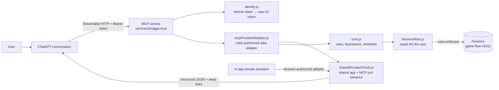

# ChatGPT App Integration — Design

## Overview

A thin Node.js MCP service (`services/chatgpt-mcp/`) exposes permission-aware read tools over Streamable HTTP. It resolves the caller's identity from the bearer token and performs **user-credentialed Firestore access over the REST API** — every application-data read carries the user's own Firebase ID token, so the same `firestore.rules` that protect the web/app clients authorize each read. The service identity is restricted to the isolated encrypted OAuth grant store and does not perform application-data reads.

The schedule/profile read tools and the in-app private AI registry
(`apps/app/src/lib/privateAiService.ts`, ~45 tools with confirmation-staged
writes and audit) are built from `services/chatgpt-mcp/src/sharedPrivateAiTools.js`.
The two surfaces therefore use one implementation for matching, filtering,
summarizing, aliases, and result projection. Each surface supplies its own
authorized data adapter.

Per the plan (§4): "Build the app as a thin orchestration layer over a reusable AllPlays application service. Do not embed business rules or authorization only inside MCP tool handlers."

## Architecture

```mermaid
flowchart LR
    U[User] --> C[ChatGPT conversation]
    C -->|Streamable HTTP + Bearer token| M[MCP service<br/>services/chatgpt-mcp]
    M --> I[identity.js<br/>refresh token → user ID token]
    M --> A[mcpPrivateAiAdapter.js<br/>rules-authorized data adapter]
    A --> S[sharedPrivateAiTools.js<br/>shared app + MCP tool behavior]
    A --> K[core.js<br/>roles, boundaries, whitelists]
    K --> R[firestoreRest.js<br/>reads AS the user]
    R -->|rules-enforced| F[(Firestore<br/>game-flow-c6311)]
    S -->|structured JSON + deep links| C
    P[In-app private assistant] -->|browser-authorized adapter| S
```

- **Transport:** `@modelcontextprotocol/sdk` `StreamableHTTPServerTransport` in stateless mode (new server+transport per request) — Cloud Run friendly, no session affinity needed.
- **Hosting target:** Cloud Run (plan §4). The spike runs locally (`npm start`) and connects to Developer Mode via a tunnel or a dev Cloud Run revision.

## Components

| File | Responsibility |
|---|---|
| `src/server.js` | Express app, auth middleware, MCP tool registration, transport wiring |
| `src/identity.js` | Bearer token → `{uid, email, idToken}`: Firebase refresh-token exchange via `securetoken.googleapis.com` (public web API key), cached until expiry; raw ID tokens also accepted |
| `src/firestoreRest.js` | Firestore REST adapter scoped to the user's ID token — rules-enforced reads; maps 403 → `permission_denied`, 404 → not-found |
| `src/core.js` | Pure domain logic with injected Firestore handle: role resolution, schedule assembly, game summary, field whitelists, deep links |
| `src/sharedPrivateAiTools.js` | Browser/server-safe shared definitions for eight schedule/profile read tools: catalog, selectors, filters, summaries, and output projection |
| `src/mcpPrivateAiAdapter.js` | Adapts user-credentialed MCP reads to the shared tool interface; no business response formatting |
| `src/oauth.js` | OAuth 2.1 broker: dynamic registration, authorization code + PKCE, rotating refresh grants, and opaque access tokens backed by the isolated encrypted production grant store |
| `scripts/get-token.mjs` | Manual sign-in helper; all configuration and credentials are runtime environment variables |

## Identity and authorization

1. Every request must carry `Authorization: Bearer <token>` — a Firebase **refresh token** (long-lived, suits a static connector secret) or a raw ID token.
2. The refresh token is exchanged for a short-lived ID token and cached. That ID token is presented to Firestore on **every read**, so `firestore.rules` — identical to the parent UI's enforcement — is the authorization boundary. A forged JWT yields identity claims but fails every Firestore call. The production OAuth broker (plan §6) replaces the raw refresh token with a proper authorization-code + PKCE flow yielding the same user-scoped credential.
3. As defense-in-depth, `resolveUserContext(db, {uid, email})` also rebuilds the role context per request:
   - owner: `teams` where `ownerId == uid`
   - admin: `teams` where `adminEmails array-contains lowercased email`
   - parent: `users/{uid}.parentOf[] → {teamId, playerId}` (team docs fetched to confirm existence)
   - `isGlobalAdmin`: `users/{uid}.isAdmin === true`
4. Tool arguments naming teams/players are validated against this context; anything outside it → `permission_denied` with no data.

## Data model touchpoints (existing collections, read-only)

- `users/{uid}` — `parentOf`, `parentTeamIds`, `email`, `isAdmin`
- `teams/{teamId}` — `name`, `ownerId`, `adminEmails`
- `teams/{teamId}/players/{playerId}` — `name`, `number` only (never `private/profile`)
- `teams/{teamId}/games/{gameId}` — `type` (`game`/`practice`), `date` (Timestamp), `opponent`, `location`, `homeScore`/`awayScore`, `rsvpSummary`
- `teams/{teamId}/games/{gameId}/rsvps/{uid}` — the caller's own RSVP doc
- `teams/{teamId}/games/{gameId}/aggregatedStats/{playerId}` — per-player stats (public tier; `privatePlayerStats` is never read)

## Tool contract

| Tool | Mode | Input | Output |
|---|---|---|---|
| `get_profile` | Read | — | Account roles, safe profile fields, teams, and linked players |
| `list_schedule` | Read | Date/range, team, player, and type filters | Stored and imported events with RSVP, rideshare, assignments, score, and deep links |
| `get_last_game` | Read | Optional team/player selector | Most recent past game plus nearby games; practices never substitute for games |
| `get_schedule_event` | Read | Event plus optional team/player selector | One event and per-child detail context |
| `list_rsvps` | Read | Schedule filters | Per-child RSVP state and aggregate summaries |
| `list_ride_offers` | Read | Event selector | Safe ride offers, requests, and capacity summary |
| `list_assignments` | Read | Event selector | Safe volunteer/task assignments and claims |
| `get_practice_packet` | Read | Practice selector | Parent packet and completion state |
| `get_game_summary` | Read | `teamId`, `gameId` | `{game: {…whitelisted}, playerStats[], deepLink}` |

Deep links use the validated legacy routes, e.g. `https://allplays.ai/live-game.html?teamId=…&gameId=…&replay=true`.

## Error handling

`core.js` throws `DomainError(code, message)` with codes `unauthenticated`, `permission_denied`, `not_found`, `invalid_argument`. The server maps these to MCP tool errors (`isError: true` with the code) and never leaks other teams' identifiers or internal stack traces.

## Testing strategy

- Unit (Vitest, `tests/unit/chatgpt-mcp-core.test.js`): pure `core.js` against a fake Firestore — role resolution, cross-team denial, date-range filtering, field whitelisting, RSVP lookup, dev-token gating.
- Security prompts from plan §11 (cross-team roster, role escalation, foreign player ID) map to unit cases asserting `permission_denied`.
- Manual: connect via ChatGPT Developer Mode; run the functional prompts from plan §11.

## Decisions

- **Stateless HTTP transport** over sessions: simplest correct spike; revisit if streaming/UI resources need session state.
- **User-credentialed Firestore REST access** over Admin SDK: reuses `firestore.rules` as the single authorization source (no duplicated permission logic to drift), removes all privileged credentials from the service, and matches how the parent UI is authorized. Trade-off: REST latency per read and no rules bypass for future cross-user aggregation — those later workflows (e.g. coach attention items) may need an Admin-SDK path behind the extracted application service.
- **Refresh token as spike bearer** (public web API key exchange): long-lived like a connector secret, revocable per-user, and structurally identical to what the OAuth broker will produce.
- **Shared schedule/profile read implementation:** the app and MCP import the
  same tool factory. Authorization and data access remain adapter-specific,
  while selectors and response behavior cannot drift between surfaces.
- **Separate package** with its own `package.json` (like `functions/`): deployable to Cloud Run independently; root repo tests still cover the pure core.
