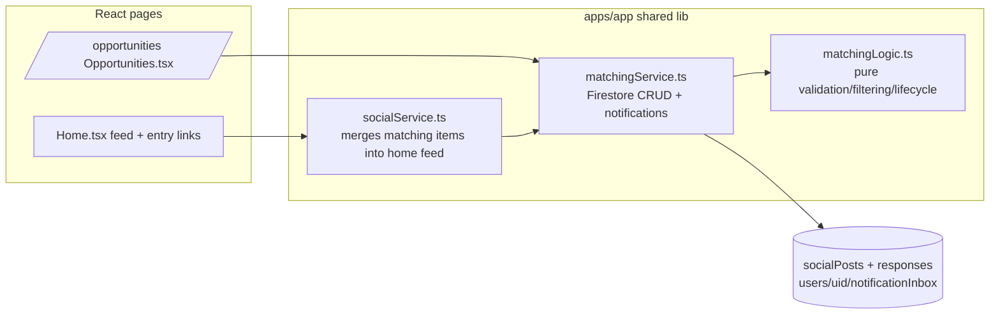

# Player/Team Matching Feed — Design

## Overview

Matching posts reuse the existing `socialPosts` collection with two new `type` values (`player_seeking_team`, `team_seeking_players`) and one new `visibility` value (`community`). Community visibility is only valid for the two matching types, enforced at create time in Firestore rules; that coupling is what lets the read rule treat any `visibility == 'community'` document as signed-in-readable.

## Architecture

## Components

- **`matchingLogic.ts`** — types (`MatchingPost`, `MatchingDetails`, filters), draft validation (`buildMatchingDetails`), contact-info guard (`containsContactInfo` blocks emails/phones per req 3.5/5.1), lifecycle (`isMatchingPostOpen`, 60/90-day expiry), filtering/sorting, feed mapping (`matchingPostToFeedItem`), home-feed relevance (`selectRelevantMatchingPosts`: sport/state match first).
- **`matchingService.ts`** — `createMatchingPost` (community doc, no `authorEmail`, no roster/player IDs), `loadOpenMatchingPosts` (equality-only query: `visibility==community`, `status==open`, `hidden==false` — provable against list rules, no composite index needed), `loadMyMatchingPosts`, `respondToMatchingPost` (responses doc keyed by responder uid for one-response-per-user idempotency + best-effort inbox notification), `setMatchingPostStatus`, `loadMatchingResponses`, `dismissMatchingResponse`.
- **`Opportunities.tsx`** — browse view with kind/sport/age/location filters, composer modals (player posts: parent-on-behalf-of-child with optional linked-player prefill that copies first name only; team posts: admin-role teams only, optional allplays.ai signup link), respond modal, "My posts" lifecycle management with responses list.
- **`Home.tsx`** — Opportunities entry links in the feed aside; matching feed cards are respond-only (no like/comment) but reportable.

## Data Model

`socialPosts/{postId}` (matching posts add): `status: 'open'|'filled'|'closed'`, `expiresAt: Timestamp`, `matching: { kind, sport, ageGroup, city, state, zip, positions, level, timeframe, openSpots, playerFirstName, signupUrl }`.

`socialPosts/{postId}/responses/{responderUid}`: `responderId/Name/PhotoUrl`, `teamId/teamName`, `message`, timestamps. Readable by responder, post author, global admins only.

`users/{uid}/notificationInbox/{itemId}`: client-creatable only for `category == 'matching_response'` with a strict field allowlist and fixed `appRoute`.

## Error Handling

All discovery queries use the existing `withTimeout` + logged-warning pattern; the home feed integration never throws (returns `[]`). Notification delivery is best-effort — a rules rejection does not fail the response.

## Security decisions

- Rules-level field allowlists on the post payload, `matching` map, responses, and notifications; `!data.keys().hasAny(['authorEmail','email','phone'])`.
- `team_seeking_players` create requires `isTeamOwnerOrAdmin(teamId)`; `player_seeking_team` requires `teamId == null` and empty `playerIds`/`media`.
- Comments and reactions are rules-blocked on community posts (respond-only surface, req 5.7).
- Discovery filters posts from blocked friendships in either direction, and response plus notification writes are rules-blocked for those pairs (req 5.6).
- Signup links restricted to `https://allplays.ai/...` (client validation) to prevent link spam.

## Deviations from requirements (phase 1)

- Req 5.3 (auto-hide at 3 reports) needs a server-side counter; reports flow into `socialReports` for admin review instead.
- Rules compile check (`firebase deploy --only firestore:rules --dry-run`) pending re-auth; rules changes are covered by static tests in `tests/unit/matching-feed-rules.test.js`.

## Testing Strategy

- `apps/app/src/lib/matchingLogic.test.ts` — validation, privacy guard, lifecycle, filters, relevance.
- `apps/app/src/lib/matchingService.test.ts` — payload shape, query constraints, respond guards, notification best-effort.
- `apps/app/src/pages/Opportunities.test.tsx` — browse, filters, composer privacy notice, respond flow, my-posts lifecycle.
- `tests/unit/matching-feed-rules.test.js` — static rules assertions.
- Known gap: Playwright smoke spec (tracked in `tests/coverage/feature-coverage-map.json`).
