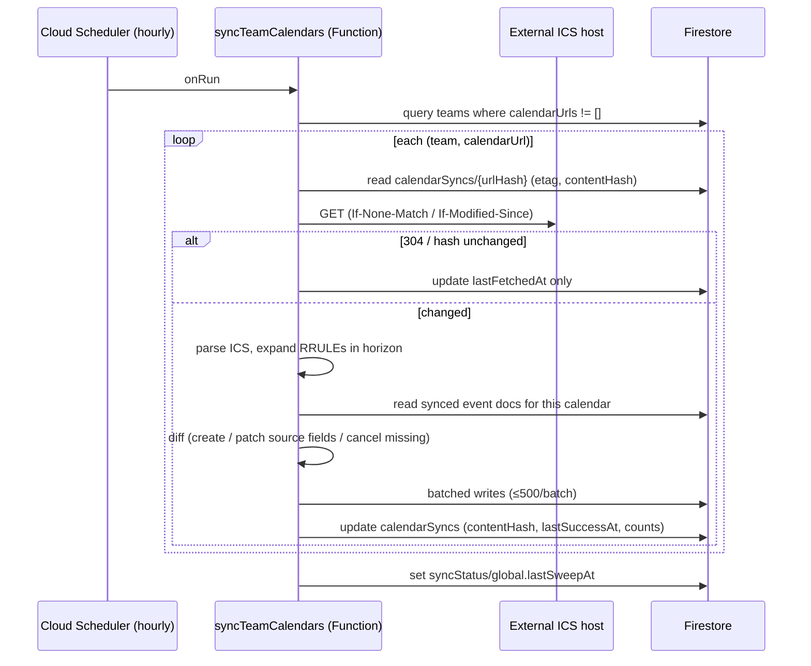
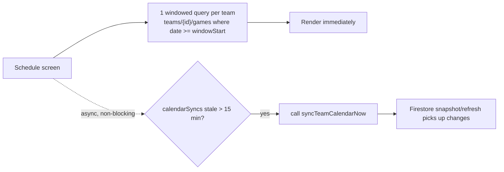
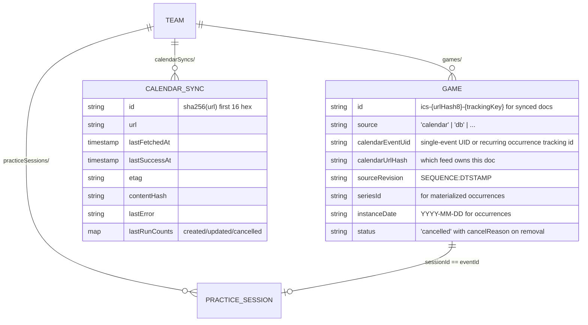

# Design: Schedule Loading Redesign

## Overview

This design implements the requirements in [requirements.md](./requirements.md): move external calendar (ICS) ingestion server-side into a scheduled Cloud Function that reconciles feeds into Firestore event docs, remove the client ICS fetch from the schedule load path, make every visible schedule event a real Firestore doc, and make practice attendance work uniformly regardless of event origin.

Research for this design was conducted directly against the codebase and production data (read-only, via the `_migration` service account):

- `apps/app/src/lib/scheduleService.ts` — `loadParentSchedule` → `buildTeamSchedule` fetches ICS inline per team (`fetchAndParseCalendar`), expands recurring practice masters client-side into synthetic `masterId__YYYY-MM-DD` IDs, and on native falls back from the Firebase SDK (5s timeout per read) to REST calls that list whole collections.
- `js/utils.js` `fetchAndParseCalendar` — Cloud Function attempt → direct fetch → 4 CORS-proxy fallbacks, 5s timeout each (worst case ~30s per dead feed, per load).
- `functions/calendar-ics-fetch-core.cjs` + `exports.fetchCalendarIcs` — server-side ICS fetch with SSRF guards, ICS validation, and a 5-minute in-memory cache already exists; there are currently **no scheduled functions** in `functions/index.js`.
- `js/calendar-ics-sync.js` (legacy) and `isTrackedCalendarEvent` (app) — both clients already suppress client-fetched ICS events when a DB doc carries a matching `calendarEventUid`. This is the backward-compatibility hinge.
- Production audit (account with 5 teams, 59 games, 3 calendar URLs): 2 of 4 practice sessions are orphans keyed by ICS UIDs (`madison-futsal-winter2-5@sniderfamily`), unreachable by the app's `isDbGame` guard.

## Architecture

### Sync pipeline (Phase 2)

Entry points sharing one reconcile core:

1. `syncTeamCalendars` — `functions.pubsub.schedule('every 60 minutes')`. Sweeps all teams (req 1.1, 1.2).
2. `syncTeamCalendarNow` — HTTPS callable, `(teamId, calendarUrl)`. Auth: team staff only. Used by on-open staleness revalidation (req 1.3) and the settings "Sync now" button (req 1.4).
3. Both wrap `functions/calendar-sync-core.cjs` (new, pure CJS module, unit-testable like the existing `*-core.cjs` modules), which fetches feeds only through the existing guarded `exports.fetchCalendarIcs` path or an extracted shared guarded helper that preserves `normalizeTargetUrl`, `fetchWithTimeout`, `BEGIN:VCALENDAR` validation, and `calendar-ics-fetch-core.cjs` cache semantics (req 1.6).

### Client read path (after Phase 2)

No ICS fetch, no proxy chain, no cross-source merging in the client. Calendar events are just game docs with `source: 'calendar'`.

### Data model

**Tracking ID and doc ID scheme for synced events:** compute the same tracking id the clients use today: `getCalendarEventTrackingId(event)` returns the occurrence id for recurring ICS instances (for example `uid__2026-03-10T23:00:00.000Z`) and falls back to the raw UID only for non-recurring/single events. Store that exact value in `calendarEventUid`. Firestore doc ID is `ics-{urlHash8}-{trackingKey}` where `urlHash8` = first 8 hex of sha256(normalized calendar URL) and `trackingKey` = the tracking id sanitized (`/` -> `_`), truncated with a sha1 suffix if > 120 chars. Deterministic IDs make every sync run idempotent (req 2.1) and namespace per feed so two teams importing the same calendar stay independent (edge case 2).

**Source-owned vs app-owned fields (req 2.3):** the sync writes only this allowlist: `date`, `end`, `location`, `title`, `opponent` (parsed), `type`, `status` + `cancelReason` (cancellation only), `source`, `calendarEventUid`, `calendarUrlHash`, `sourceRevision`, `updatedAt`. Everything else (`statTrackerConfigId`, `arrivalTime`, `notes`, `kitColor`, `assignments`, `gamePlan`, scores, …) is never touched. Patches use `update()` with explicit field paths, never `set()` without merge.

**Practice sessions (req 4.2, 4.3):** session doc ID == event ID. `saveStaffPracticeAttendance` uses an idempotent merge write to `doc(practiceSessions/{eventId})`, but the created payload must preserve the existing document shape: `attendance: normalizedAttendance`, `attendancePlayers`, and `aiContext.attendanceSummary` at the root. Do not write raw `players` / `checkedInCount` / `rosterSize` at the practice-session root. Reads resolve by exact ID first, falling back to the legacy `eventId ==` query only for pre-migration docs. Nearest-date fuzzy matching is removed for writes.

### Reconcile algorithm (calendar-sync-core.cjs)

For one (team, calendarUrl):

1. Fetch ICS via the shared guarded fetch implementation used by `exports.fetchCalendarIcs` (or call that HTTPS function from server code only if no helper has been extracted); on invalid/empty ICS, record `lastError` and stop — never touch event docs (req 2.9).
2. Parse; expand RRULEs within horizon `[now − 30d, now + 12mo]`; apply `RECURRENCE-ID` exceptions (req 2.7); compute `trackingId = getCalendarEventTrackingId(event)` for each expanded event and use it for doc ID generation, `calendarEventUid`, dedupe, and legacy adoption.
3. Load current synced docs: `games where calendarUrlHash == urlHash8`, plus legacy-linked docs `where calendarEventUid in feedTrackingIds` (chunked `in` queries) to adopt docs created by the legacy manual import (req 2.8).
4. Diff:
   - Tracking id not in DB → **create** (req 2.2).
   - Tracking id in DB, `sourceRevision` or field-hash differs → **patch allowlist** (req 2.3, 2.4).
   - Tracking id cancelled in feed → patch `status: 'cancelled'` (req 2.6).
   - Doc's tracking id absent from feed → increment `missingCount`; at 1 → `status: 'cancelled'`, `cancelReason: 'removed-from-calendar'`; at ≥3 AND future-dated AND no attached data → delete (req 2.5).
   - Doc present again after cancellation → un-cancel and reset `missingCount`.
5. Commit in batches of ≤500 writes; update `calendarSyncs` with counts and hashes (req 6.3).

### Attendance flow (Phase 1 + 2)

- Drop the `isDbGame` guard in `assertPracticeAttendanceManagementEvent` for practice events that have any Firestore-backed identity; after Phase 2 every visible practice is doc-backed, so the guard reduces to "is a practice + is staff" (req 4.1).
- Phase 1 interim: calendar practices without docs key their session to `calendarEventUid` (matching how legacy pages historically wrote the orphan sessions), so attendance works even before server sync ships.
- `loadStaffPracticeAttendance` no longer throws "not linked to a session yet"; a missing session yields an empty roster-based attendance sheet, and the first save creates the session (req 4.2).

### Schedule load performance changes (Phase 1)

1. **Async calendar merge (req 3.2):** `loadParentSchedule` returns DB-backed events immediately; a second emission (callback/async iterator consumed by `Schedule.tsx` / `homeService`) merges calendar events when the fetch settles. Cap the client proxy chain at 1 fallback.
2. **Native REST windows (req 3.3):** replace `nativeListScheduleEventDocuments('teams/{id}/games')` full-collection listing with parent-scoped `:runQuery` structuredQuery date filters posted to `/documents/teams/{teamId}:runQuery` (or the equivalent parent-path endpoint), not the root `/documents:runQuery`; same for `practiceSessions`. The existing `nativeRunQuery` helper in `scheduleService.ts` currently targets root collections and must be extended or wrapped so `from: [{ collectionId: 'games' }]` is scoped to the team document.
3. **Scope pruning (req 3.4):** `resolveParentScheduleChildren` checks `isTeamActive` before per-player reads (already partially true) and passes the loaded team doc into `buildTeamSchedule` to eliminate the duplicate `loadTeam` read.
4. **Materialized in-app recurrences (req 3.5, Phase 2):** on series create/edit, write occurrence docs (`seriesId`, `instanceDate`, ID `masterId__YYYY-MM-DD` — same shape as today's synthetic IDs so existing session links keep working); remove `expandRecurrence` from the read path. A migration materializes existing series.
5. **Denormalized summaries (req 3.6, Phase 3):** Firestore triggers on `rsvps`, `rideOffers`, `assignmentClaims`, and session `attendance` maintain `rsvpSummary` / `rideshareSummary` / `openAssignmentCount` / `attendanceSummary` on the parent game doc. `hydrateEventDetails` then runs only on the detail screen.

### Firestore rules

- `calendarSyncs` subcollection: read for team staff (settings banner, req 6.1); writes only via Admin SDK (no client write rule).
- Synced event docs live in `teams/{teamId}/games` — existing game rules apply unchanged.
- Session-ID-as-event-ID writes are already covered by existing `practiceSessions` staff-write rules.

## Error Handling

| Failure | Behavior |
|---|---|
| Feed down / timeout | `calendarSyncs.lastError` set; event docs untouched; schedule renders last-good data (req 6.1, 2.9) |
| Feed returns truncated/empty ICS | Rejected by `BEGIN:VCALENDAR` validation → treated as fetch failure, not as "all events removed" (edge case 1) |
| One calendar fails mid-sweep | Per-calendar try/catch; sweep continues; failure isolated to that feed |
| Function timeout on huge feeds | 300s `runWith` timeout; batched writes are idempotent, next run resumes cleanly (deterministic IDs) |
| Unstable feed UIDs | Remove+add; cancelled originals keep history; one-time migration heuristic (same team + start time within 60s) may link replacements (edge case 6) |
| Scheduler silently stops (bad deploy) | `syncStatus/global.lastSweepAt` freshness asserted in `scheduled-prod-smoke` → red check (req 6.2) |
| Client callable fails | On-open revalidation is fire-and-forget; UI never blocks or errors on it |

## Design Decisions

1. **Sync into `games`, not a new `events` collection** — both clients and Firestore rules already read/enforce `games`; the existing `calendarEventUid` suppression in both clients gives zero-change backward compatibility (req 5.1–5.3). A new collection would require rules, both read paths, and a data migration for no benefit.
2. **Cancel-don't-delete** — protects attendance/RSVP history against feed truncation and provider outages; deletion is opt-in narrow (future + no data + 3 misses).
3. **UID-based identity over date matching** — moved events keep their doc, so attached data follows automatically; this specifically fixes today's wrong-occurrence fuzzy matching.
4. **Session ID == event ID** — removes the query-then-create race and the fuzzy resolver; legacy fallback query keeps old sessions readable until migrated.
5. **Hourly + on-open hybrid cadence** — hourly bounds worst-case staleness cheaply (conditional fetches); on-open revalidation gives seconds-level freshness exactly when someone cares, without the client ever blocking on it.

## Testing Strategy

1. **`calendar-sync-core.cjs` unit tests** (`tests/unit/`, Vitest, like existing `*-core` tests): create / patch-allowlist (app-owned fields preserved) / cancel-on-missing / un-cancel / delete-guard / RRULE horizon + RECURRENCE-ID / invalid-ICS rejection / tracking-id sanitization / recurring occurrence `calendarEventUid` values / legacy-doc adoption via `calendarEventUid`. Fixture ICS files checked in.
2. **App unit tests** (`apps/app`, colocated): async two-phase schedule load emission; parent-scoped native REST `runQuery` fallback shape; attendance auto-create-on-save (merge to deterministic ID while preserving nested `attendance` shape); calendar-practice attendance no longer blocked; exact-ID session resolution with legacy fallback.
3. **Regression tests (bug-fix rule):** failing-before tests for the "not linked to a session yet" dead end and the nearest-date wrong-occurrence match.
4. **Functions deployability:** extend `tests/unit/functions-deployable-exports.test.js` to cover the new scheduled/callable exports (guards the known deploy-prod failure mode).
5. **Smoke** (`tests/smoke/` + prod smoke workflow): schedule boots with a team whose calendar URL is unreachable (no spinner hang); `scheduled-prod-smoke` asserts `lastSweepAt` freshness.
6. **Migration scripts** (`_migration/`): dry-run mode printing planned re-links (orphan sessions → synced docs) before writing; audited with the same service-account pattern used for this design's research.
